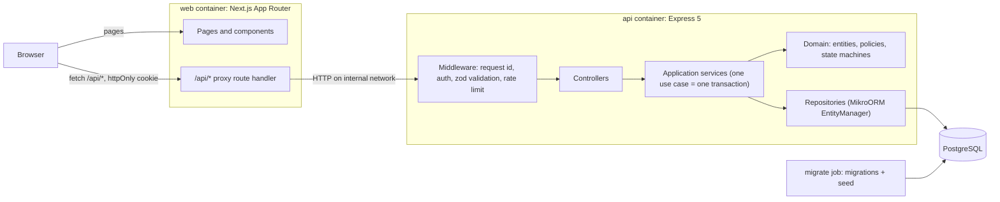
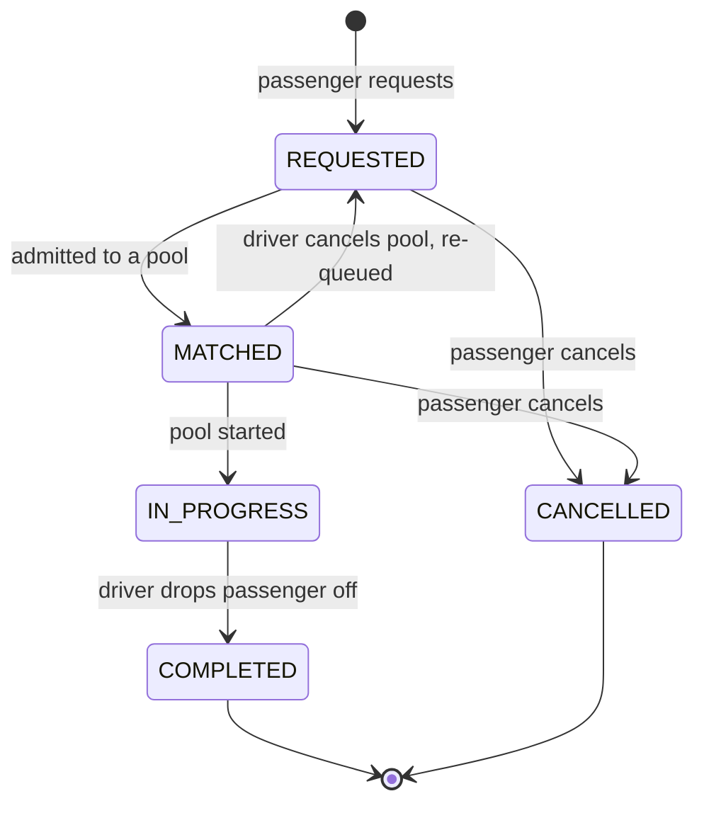
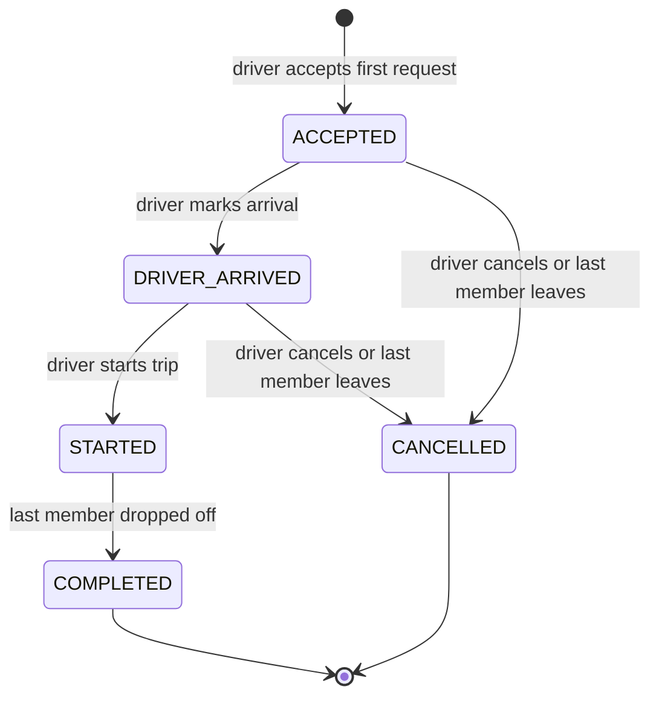
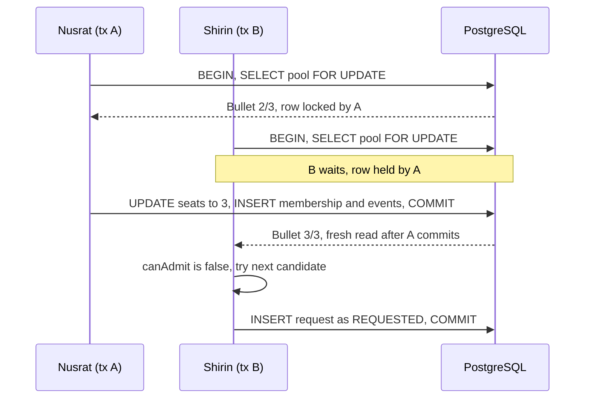
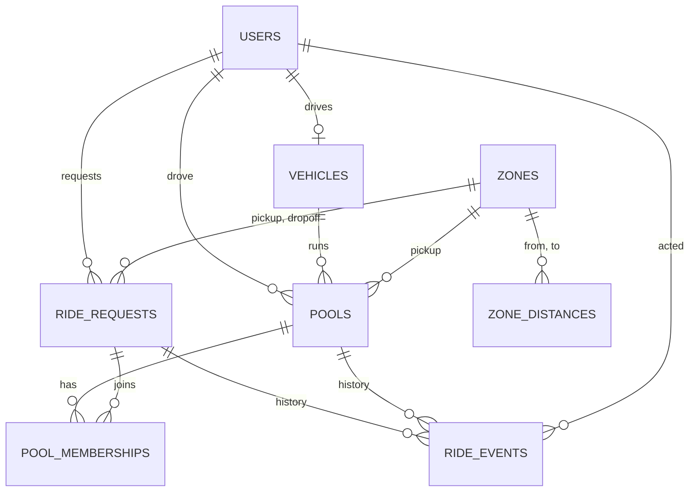
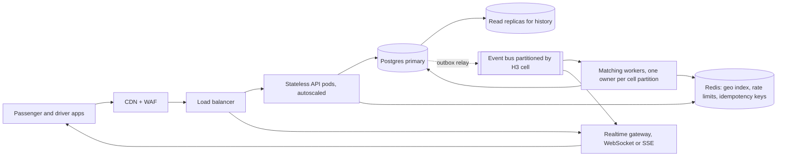

# Dhaka Tesla Pool — Build Specification

**Purpose of this document.** This is the single source of truth for building this
project. It contains the architecture, domain model, database schema, API contract,
frontend spec, Docker setup, test plan, git workflow and a step-by-step build order.
An agent (or engineer) should be able to implement the entire working system —
backend, frontend, database, Docker, tests, migrations, seed data — from this file
alone, without further clarification. Follow it top to bottom. If something here is
genuinely ambiguous, make the most reasonable assumption, document it in
`README.md` under "Key Decisions", implement it consistently, and keep moving —
do not stall waiting for input.

If any instruction in this file conflicts with the original assignment PDF, this file
wins — it is a fully-specified interpretation of that PDF, written to remove ambiguity.

---

## 0. How to use this document (for the building agent)

1. Read this whole file once before writing any code.
2. Follow **Section 17 (Build Order)** as your task list, in order. Each step names
   the git branch to use and the files it produces.
3. Copy code blocks in this document verbatim where given — they are not
   illustrative, they are the actual intended implementation. Fill in the gaps
   (remaining CRUD, wiring, imports) consistently with the patterns shown.
4. After each step in Section 17, run the build and any tests that now apply
   before moving to the next step.
5. At the end, verify the system against **Section 18 (Definition of Done)**
   before considering the work finished.
6. Never invent scope beyond this document (no Kafka, Redis, microservices,
   Kubernetes) — Section 16 (Bonus) is a *written* reasoning exercise, not
   something to implement in the MVP.

---

## 1. Product Summary & Cast

A ride-pooling MVP for Dhaka. Passengers request rides between fixed zones;
compatible requests share a three-wheeled "Tesla" (CNG-style auto-rickshaw)
driven by an independent driver; each passenger sees only their own fare and
status; the system keeps a full history of what happened.

**Seed cast — use these names consistently everywhere (seed data, tests, README, demo):**

| Person | Role | Detail |
|---|---|---|
| Jashim | Driver | Owns **Bullet**, a 3-seat Tesla |
| Kamal | Driver (second, for ownership/negative tests) | Owns **Toofan**, a 3-seat Tesla, starts offline |
| Nusrat | Passenger | Requests Banani → Mohakhali |
| Rafiq | Passenger | Requests Banani → Gulshan 1 |
| Shirin | Passenger | Requests Banani → Mohakhali (last seat / overflow case) |

Never use `user1`/`driver1`-style placeholders anywhere in seed data, tests, or the README.

---

## 2. Architecture



**The browser only ever talks to Next.js.** A catch-all Route Handler at
`app/api/[...path]/route.ts` forwards `/api/*` to the Express API over the
internal Docker network and passes the auth cookie through unchanged. Reasons:

- Keeps the auth cookie first-party (web and API may land on different domains
  in free hosting; cross-site cookies are unreliable).
- Eliminates CORS as a concern.
- The API base URL is read at request time from `API_INTERNAL_URL`, so the
  same built image works in Compose and in production.

**Dependency direction inside the API:** routes → controllers → application
services → domain. Services use repositories.

- Controllers: validate input (Zod), call exactly one service method, map the
  result to a response DTO. No business logic in controllers.
- Application services: one class per use case group, one method per use case,
  each method wraps exactly one DB transaction.
- Domain entities: carry MikroORM mapping decorators but their methods never
  touch `EntityManager`. They must be unit-testable via plain `new Entity(...)`.

### Monorepo layout

```
dhaka-tesla-pool/
├─ apps/
│  ├─ api/
│  │  ├─ src/
│  │  │  ├─ main.ts                    # bootstrap, graceful shutdown
│  │  │  ├─ app.ts                     # buildApp(deps): middleware, routers, error handler
│  │  │  ├─ composition-root.ts        # builds every service/repository once (constructor DI)
│  │  │  ├─ config/env.ts              # zod-validated env, fail fast on startup
│  │  │  ├─ http/
│  │  │  │  ├─ request-id.ts
│  │  │  │  ├─ authenticate.ts
│  │  │  │  ├─ require-role.ts
│  │  │  │  ├─ validate.ts
│  │  │  │  └─ error-handler.ts
│  │  │  ├─ shared/domain/
│  │  │  │  ├─ state-machine.ts
│  │  │  │  ├─ domain-error.ts
│  │  │  │  ├─ aggregate-root.ts
│  │  │  │  └─ money.ts
│  │  │  ├─ modules/
│  │  │  │  ├─ auth/                   # AuthService, PasswordHasher, TokenService, routes
│  │  │  │  ├─ geography/              # Zone, ZoneDistanceMatrix (DistanceProvider)
│  │  │  │  ├─ pricing/                # FarePolicy, StandardFarePolicy
│  │  │  │  ├─ rides/                  # RideRequest entity, passenger use cases, presenter
│  │  │  │  ├─ pools/                  # Pool, PoolMembership, PoolMatcher, driver trip use cases
│  │  │  │  ├─ drivers/                # Vehicle, availability + queue use cases
│  │  │  │  └─ audit/                  # RideEvent, AuditTrail
│  │  │  └─ database/
│  │  │     ├─ mikro-orm.config.ts
│  │  │     ├─ migrations/
│  │  │     └─ seeders/
│  │  ├─ test/
│  │  │  ├─ unit/
│  │  │  └─ integration/
│  │  └─ Dockerfile
│  └─ web/
│     ├─ src/
│     │  ├─ app/                       # routes, see Section 10
│     │  ├─ features/{auth,rides,driver}/
│     │  ├─ components/ui/             # Button, Card, StatusBadge, SeatMeter, EmptyState, ErrorState
│     │  └─ lib/                       # apiClient, formatBDT, ride-status
│     └─ Dockerfile
├─ packages/
│  └─ shared/                          # zod schemas, DTO types, status enums used by both apps
├─ docs/
│  ├─ DESIGN.md                        # this file
│  ├─ architecture.mmd
│  └─ erd.mmd
├─ docker-compose.yml
├─ .env.example
└─ README.md
```

Group code by **feature**, not by layer, inside `modules/` and `features/` — a
change to pooling should touch one folder.

---

## 3. Domain Model & OOP Design

Entities hold behavior, not just fields.

- **`Pool`** — aggregate root for one Tesla trip. Owns `seatsOccupied` and
  decides whether a request can be admitted. Changing its own status cascades
  to its members (e.g. starting the pool moves every member to `IN_PROGRESS`
  and locks in their fares).
- **`RideRequest`** — owns its seats, route distance, fare quotes, and its own
  allowed transitions.
- **`Vehicle`** — owns capacity and online state.
- **`Money`** — immutable value object wrapping integer paisa.

| Pattern | Where | Why |
|---|---|---|
| Rich domain model / aggregate | `Pool` owns seats + admission; `RideRequest` owns its transitions | Rules live next to the data they protect |
| Table-driven state machine | `StateMachine<S>` with `RideRequestLifecycle`, `PoolLifecycle` | One readable transition table per lifecycle; every illegal transition is testable |
| Strategy | `FarePolicy`, `PoolCompatibilityPolicy`, `DistanceProvider` | New matching rules, surcharges, or real routing can be added without touching services |
| Unit of Work + Repository | MikroORM `EntityManager` + custom repositories | Mutate objects, save once, inside one transaction |
| Composition root + constructor injection | `composition-root.ts` | Explicit wiring for ~20 classes; tests swap in fakes; no DI container needed |
| Presenter / DTO mapping | `RidePresenter.forPassenger()` / `.forDriver()` | Entities never serialize directly — passengers never see co-riders' names/fares |
| Domain events → audit trail | Aggregates record events; services persist them as `ride_events` before commit | History is produced by the same code that makes the change |

Errors: domain code throws subclasses of `DomainError`, each with a stable
`code` (`POOL_FULL`, `INVALID_TRANSITION`, `ACTIVE_RIDE_EXISTS`, ...). The
domain knows nothing about HTTP; a single error-handling middleware maps codes
to status codes (table in Section 9).

```ts
// shared/domain/state-machine.ts
export class StateMachine<S extends string> {
  constructor(
    private readonly name: string,
    private readonly transitions: Readonly<Record<S, readonly S[]>>,
  ) {}

  can(from: S, to: S): boolean {
    return this.transitions[from].includes(to);
  }

  assert(from: S, to: S): void {
    if (!this.can(from, to)) throw new InvalidTransitionError(this.name, from, to);
  }
}

export const RideRequestLifecycle = new StateMachine<RideRequestStatus>('RideRequest', {
  REQUESTED:   ['MATCHED', 'CANCELLED'],
  MATCHED:     ['IN_PROGRESS', 'CANCELLED', 'REQUESTED'], // back to REQUESTED = re-queued after driver cancels
  IN_PROGRESS: ['COMPLETED'],
  COMPLETED:   [],
  CANCELLED:   [],
});

export const PoolLifecycle = new StateMachine<PoolStatus>('Pool', {
  ACCEPTED:       ['DRIVER_ARRIVED', 'CANCELLED'],
  DRIVER_ARRIVED: ['STARTED', 'CANCELLED'],
  STARTED:        ['COMPLETED'],
  COMPLETED:      [],
  CANCELLED:      [],
});
```

```ts
// modules/pools/pool.entity.ts
export class Pool extends AggregateRoot {
  // mapped fields: id, vehicle, driverId, pickupZoneId, status, seatCapacity, seatsOccupied, memberships

  isJoinable(): boolean {
    return this.status === 'ACCEPTED' || this.status === 'DRIVER_ARRIVED';
  }

  hasRoomFor(seats: number): boolean {
    return this.seatsOccupied + seats <= this.seatCapacity;
  }

  canAdmit(request: RideRequest, policy: PoolCompatibilityPolicy): boolean {
    return this.isJoinable() && this.hasRoomFor(request.seats) && policy.accepts(this, request);
  }

  admit(request: RideRequest, policy: PoolCompatibilityPolicy, actor: Actor): void {
    if (!this.isJoinable()) throw new PoolNotJoinableError(this.id, this.status);
    if (!this.hasRoomFor(request.seats)) throw new PoolFullError(this.id, this.seatCapacity - this.seatsOccupied);
    if (!policy.accepts(this, request)) throw new IncompatibleRequestError(this.id, request.id);

    this.seatsOccupied += request.seats;
    this.memberships.add(PoolMembership.open(this, request));
    request.markMatched(actor); // guarded by RideRequestLifecycle
    this.record(new PassengerJoined(this.id, request.id, actor, this.seatsOccupied));
  }
}
```

The compatibility policy is **passed into** `admit()`, never checked by
callers first — so the passenger auto-join path and the driver accept path can
never diverge on the rules.

---

## 4. Ride and Pool Lifecycles

One passenger's journey (`RideRequest`) and one Tesla's trip (`Pool`) are
**separate state machines**, because passengers join and leave a pool at
different times.





Rules:

- A pool accepts new members while `ACCEPTED` or `DRIVER_ARRIVED`; locked once `STARTED`.
- Passengers can cancel while `REQUESTED` or `MATCHED`; not once the trip has started.
- If the last active member leaves before the pool starts, the pool auto-cancels.
- If a driver cancels a pool, members go back to `REQUESTED` (not `CANCELLED`) —
  they didn't cancel, so they shouldn't lose their ride. Their membership row
  records `left_at` + `leave_reason = 'DRIVER_CANCELLED'`. They are **not**
  re-matched inside the same transaction (that would require locking other
  pools while holding this one); they simply reappear in drivers' queues.
- A pool completes itself when its last active member is dropped off.
- Any transition not present in the tables above must be rejected with `409 INVALID_TRANSITION`.

---

## 5. Geography & Matching Rule

**Seed zones** (id, code, name — invent reasonable lat/long for each):
`BANANI`, `GULSHAN_1`, `GULSHAN_2`, `MOHAKHALI`, `FARMGATE`, `DHANMONDI`,
`MIRPUR_10`, `UTTARA`, `BASHUNDHARA`.

**Seed distances** (`zone_distances`, symmetric — seed both directions), at minimum:

| From | To | Distance |
|---|---|---|
| Banani | Mohakhali | 3.0 km |
| Banani | Gulshan 1 | 2.0 km |
| Gulshan 1 | Mohakhali | 2.5 km |

Fill in the remaining pairs with reasonable round-number estimates and document
them in the README's data section.

**Matching rule** — a `RideRequest` may join a `Pool` only if **all** of:

1. The pool is joinable (`ACCEPTED` or `DRIVER_ARRIVED`).
2. The request's pickup zone equals the pool's pickup zone.
3. Seats fit: `seatsOccupied + request.seats ≤ seatCapacity`.
4. The request's drop-off zone is within **3.0 km** of every active member's
   drop-off zone (same zone counts as 0 km), using `ZoneDistanceMatrix`.

**Tie-break:** when several pools qualify, pick the oldest (`created_at`, then `id`).

**Two entry paths, both call `Pool.admit()` under the pool's row lock:**

- *At request time* — `PoolMatcher.tryAutoJoin` looks for a qualifying pool in
  the same transaction that creates the request.
- *From the driver queue* — accepting a request either creates a new pool or
  admits into the driver's current active pool.

**Reference walk-through (must match seed data & tests exactly):**

| Time | Event | Occupancy |
|---|---|---|
| 8:40 | Jashim goes online at Banani | 0/3 |
| 8:41 | Nusrat requests Banani → Mohakhali, 1 seat → `REQUESTED` | 0/3 |
| 8:41 | Jashim accepts Nusrat → pool created, Nusrat `MATCHED` | 1/3 |
| 8:43 | Rafiq requests Banani → Gulshan 1, 1 seat; Gulshan 1 ↔ Mohakhali = 2.5 km ≤ 3 km → auto-joins | 2/3 |
| 8:43:30 | Shirin requests Banani → Mohakhali, 1 seat → auto-joins, last seat | 3/3 |

**Edge case to test explicitly:** if Shirin instead requests 2 seats, `2 + 2 >
3` so she stays `REQUESTED` and Bullet is never overbooked.

---

## 6. Fare Model & Money

```
passengerFare  = baseFare + distanceCharge − poolDiscount
baseFare       = ৳30 per request (3,000 paisa); never discounted
distanceCharge = ৳20 per km × km × seats (2 paisa per metre)
poolDiscount   = 30% of distanceCharge (3,000 basis points), floored to whole paisa,
                 applied only if the pool has ≥ 2 active requests at the moment it STARTS
```

Reference fares (must match tests exactly):

| | Nusrat | Rafiq |
|---|---|---|
| Trip | Banani → Mohakhali, 3.0 km, 1 seat | Banani → Gulshan 1, 2.0 km, 1 seat |
| Base fare | ৳30.00 | ৳30.00 |
| Distance charge | ৳60.00 | ৳40.00 |
| Pool discount | −৳18.00 | −৳12.00 |
| **Pooled fare** | **৳72.00** (7,200 paisa) | **৳58.00** (5,800 paisa) |
| Solo fare | ৳90.00 (9,000 paisa) | ৳70.00 (7,000 paisa) |

Timing:

- At **request time**, return both `estSoloFarePaisa` and `estPooledFarePaisa` (it isn't known yet whether they'll share).
- At **pool start**, compute the final fare once per active member, store it with `pricing_version = 'v1'`, and never change it again — even if a co-rider later cancels.

Money handling:

- Store as `integer` paisa columns; never `NUMERIC`/`float`.
- Implement a `Money` value object (`ofPaisa`, `plus`, `minus`, `percentOfBps` which floors); all fare math goes through it.
- Format to taka only at the UI edge: `Intl.NumberFormat('en-BD', { style: 'currency', currency: 'BDT' })`.
- Payment method is `CASH` only in the MVP (`payment_method` column exists for a future `TESLA_PAY` wallet).

```ts
export class StandardFarePolicy implements FarePolicy {
  readonly version = 'v1';
  private readonly baseFare = Money.ofPaisa(3_000); // ৳30
  private readonly paisaPerMetre = 2;               // ৳20 per km
  private readonly poolDiscountBps = 3_000;         // 30%

  quote({ distanceM, seats, pooled }: TripForPricing): FareBreakdown {
    const distance = Money.ofPaisa(distanceM * seats * this.paisaPerMetre);
    const discount = pooled ? distance.percentOfBps(this.poolDiscountBps) : Money.zero(); // floors
    const total = this.baseFare.plus(distance).minus(discount);
    return { base: this.baseFare, distance, discount, total, version: this.version };
  }
}
```

---

## 7. Concurrency & Data Consistency

**The scenario to solve:** Bullet has 1 seat left; Nusrat and Shirin both try
to claim it at nearly the same instant; both initially observe 1 free seat.

Three layers, in order of authority:

1. **Row lock.** Every use case that changes pool membership opens a
   transaction and loads the pool with `SELECT … FOR UPDATE`
   (`LockMode.PESSIMISTIC_WRITE` in MikroORM) *before* reading its seat count.
   The second transaction blocks until the first commits, then reads the
   updated count.
2. **Domain check.** `Pool.admit()` re-validates against the freshly-locked
   data — never against data read before the lock.
3. **Database backstop.** `CHECK (seats_occupied BETWEEN 0 AND seat_capacity)`
   on `pools` makes overbooking structurally impossible even if application
   code has a bug or someone runs raw SQL. A violation is SQLSTATE `23514` →
   map to `409`.

Partial unique indexes catch the other races (see Section 8):
one active request per passenger, one active pool per vehicle, one active
membership per request.

**Lock ordering:** always lock the `Pool` row before touching its
`RideRequest`. When multiple pools are candidates, lock them in
`(created_at, id)` order to avoid deadlocks.

**Isolation level:** Postgres default `READ COMMITTED` + explicit row locks —
not `SERIALIZABLE`. Locks make contention visible and simple to reason about;
`SERIALIZABLE` would require catching and retrying serialization failures for
no added correctness here, since pools never hold more than a few passengers.

**MikroORM pitfalls to avoid:**

- Lock the `Pool` row alone first; load `memberships` in a **second** query.
  Postgres rejects `FOR UPDATE` across an outer join, which a joined
  `populate()` would produce.
- Never reuse a `Pool` instance loaded before the lock was acquired — the
  identity map would hand back stale data.



```ts
// modules/pools/pool-matcher.ts
async tryAutoJoin(em: EntityManager, request: RideRequest): Promise<Pool | null> {
  // cheap pre-filter without locks, ordered by created_at, id (consistent lock order)
  const candidateIds = await this.pools.findJoinableIds(em, request.pickupZoneId, request.seats);

  for (const id of candidateIds) {
    const pool = await em.findOneOrFail(Pool, id, { lockMode: LockMode.PESSIMISTIC_WRITE });
    await em.populate(pool, ['memberships.rideRequest']); // separate query; members only change under this lock
    if (pool.canAdmit(request, this.compatibility)) {      // re-checked on fresh, locked data
      pool.admit(request, this.compatibility, Actor.system());
      return pool;
    }
  }
  return null; // stays REQUESTED and shows up in driver queues
}
```

**Test this exact scenario** (see Section 15): Bullet at 2/3 occupied, Nusrat
and Shirin both request the last seat from two separate DB connections in
parallel; assert exactly one ends `MATCHED`, the other stays `REQUESTED`, and
`seats_occupied` is exactly `3`. Repeat the run ~50 times in CI to catch flakiness.

---

## 8. Database Schema



Run this as the first migration (`apps/api/src/database/migrations/`):

```sql
CREATE TABLE users (
  id            uuid PRIMARY KEY DEFAULT gen_random_uuid(),
  full_name     varchar(80) NOT NULL,
  phone         varchar(14) NOT NULL UNIQUE,              -- login id, E.164: +8801800000001
  password_hash text        NOT NULL,
  role          text        NOT NULL CHECK (role IN ('PASSENGER','DRIVER')),
  created_at    timestamptz NOT NULL DEFAULT now()
);

CREATE TABLE zones (
  id        smallint PRIMARY KEY,
  code      varchar(24)  NOT NULL UNIQUE,                  -- 'BANANI'
  name      varchar(40)  NOT NULL,
  latitude  numeric(8,5) NOT NULL,
  longitude numeric(8,5) NOT NULL
);

CREATE TABLE zone_distances (
  from_zone_id smallint NOT NULL REFERENCES zones(id),
  to_zone_id   smallint NOT NULL REFERENCES zones(id),
  distance_m   integer  NOT NULL CHECK (distance_m > 0),
  PRIMARY KEY (from_zone_id, to_zone_id),
  CHECK (from_zone_id <> to_zone_id)
);

CREATE TABLE vehicles (
  id              uuid PRIMARY KEY DEFAULT gen_random_uuid(),
  driver_id       uuid        NOT NULL UNIQUE REFERENCES users(id),
  display_name    varchar(40) NOT NULL,                    -- 'Bullet'
  plate_number    varchar(20) NOT NULL UNIQUE,
  seat_capacity   smallint    NOT NULL CHECK (seat_capacity BETWEEN 1 AND 6),
  is_online       boolean     NOT NULL DEFAULT false,
  current_zone_id smallint    REFERENCES zones(id),
  updated_at      timestamptz NOT NULL DEFAULT now(),
  CHECK (NOT is_online OR current_zone_id IS NOT NULL)
);

CREATE TABLE ride_requests (
  id                    uuid PRIMARY KEY DEFAULT gen_random_uuid(),
  passenger_id          uuid     NOT NULL REFERENCES users(id),
  pickup_zone_id        smallint NOT NULL REFERENCES zones(id),
  dropoff_zone_id       smallint NOT NULL REFERENCES zones(id),
  seats                 smallint NOT NULL CHECK (seats BETWEEN 1 AND 6),
  distance_m            integer  NOT NULL CHECK (distance_m > 0),   -- snapshot used for pricing
  status                text     NOT NULL DEFAULT 'REQUESTED'
                        CHECK (status IN ('REQUESTED','MATCHED','IN_PROGRESS','COMPLETED','CANCELLED')),
  est_solo_fare_paisa   integer  NOT NULL CHECK (est_solo_fare_paisa > 0),
  est_pooled_fare_paisa integer  NOT NULL CHECK (est_pooled_fare_paisa > 0),
  fare_base_paisa       integer,
  fare_distance_paisa   integer,
  fare_discount_paisa   integer,
  fare_total_paisa      integer,
  pricing_version       varchar(16) NOT NULL,
  payment_method        text NOT NULL DEFAULT 'CASH' CHECK (payment_method IN ('CASH')),
  created_at            timestamptz NOT NULL DEFAULT now(),
  updated_at            timestamptz NOT NULL DEFAULT now(),
  completed_at          timestamptz,
  cancelled_at          timestamptz,
  CHECK (pickup_zone_id <> dropoff_zone_id),
  CHECK (num_nulls(fare_base_paisa, fare_distance_paisa, fare_discount_paisa, fare_total_paisa) IN (0, 4)),
  CHECK (fare_total_paisa = fare_base_paisa + fare_distance_paisa - fare_discount_paisa),
  CHECK (status NOT IN ('IN_PROGRESS','COMPLETED') OR fare_total_paisa IS NOT NULL),
  CHECK ((status = 'COMPLETED') = (completed_at IS NOT NULL)),
  CHECK ((status = 'CANCELLED') = (cancelled_at IS NOT NULL))
);

CREATE TABLE pools (
  id             uuid PRIMARY KEY DEFAULT gen_random_uuid(),
  vehicle_id     uuid     NOT NULL REFERENCES vehicles(id),
  driver_id      uuid     NOT NULL REFERENCES users(id),  -- snapshot of who drove this trip
  pickup_zone_id smallint NOT NULL REFERENCES zones(id),
  status         text     NOT NULL DEFAULT 'ACCEPTED'
                 CHECK (status IN ('ACCEPTED','DRIVER_ARRIVED','STARTED','COMPLETED','CANCELLED')),
  seat_capacity  smallint NOT NULL,                        -- snapshot of vehicle capacity
  seats_occupied smallint NOT NULL DEFAULT 0,
  created_at     timestamptz NOT NULL DEFAULT now(),
  updated_at     timestamptz NOT NULL DEFAULT now(),
  CHECK (seats_occupied BETWEEN 0 AND seat_capacity)       -- the overbooking backstop
);

CREATE TABLE pool_memberships (
  id              uuid PRIMARY KEY DEFAULT gen_random_uuid(),
  pool_id         uuid NOT NULL REFERENCES pools(id),
  ride_request_id uuid NOT NULL REFERENCES ride_requests(id),
  joined_at       timestamptz NOT NULL DEFAULT now(),
  left_at         timestamptz,
  leave_reason    text CHECK (leave_reason IN ('PASSENGER_CANCELLED','DRIVER_CANCELLED')),
  UNIQUE (pool_id, ride_request_id),
  CHECK ((left_at IS NULL) = (leave_reason IS NULL))
);

CREATE TABLE ride_events (
  id              bigint GENERATED ALWAYS AS IDENTITY PRIMARY KEY,
  ride_request_id uuid REFERENCES ride_requests(id),
  pool_id         uuid REFERENCES pools(id),
  actor_user_id   uuid REFERENCES users(id),               -- NULL means system
  type            varchar(40) NOT NULL,                    -- PASSENGER_JOINED, POOL_STARTED, ...
  from_status     varchar(20),
  to_status       varchar(20),
  data            jsonb NOT NULL DEFAULT '{}',             -- fare breakdown, seats after, reason
  occurred_at     timestamptz NOT NULL DEFAULT now(),
  CHECK (ride_request_id IS NOT NULL OR pool_id IS NOT NULL)
);

-- integrity
CREATE UNIQUE INDEX uq_active_request_per_passenger ON ride_requests (passenger_id)
  WHERE status IN ('REQUESTED','MATCHED','IN_PROGRESS');
CREATE UNIQUE INDEX uq_active_pool_per_vehicle ON pools (vehicle_id)
  WHERE status IN ('ACCEPTED','DRIVER_ARRIVED','STARTED');
CREATE UNIQUE INDEX uq_active_membership_per_request ON pool_memberships (ride_request_id)
  WHERE left_at IS NULL;

-- access paths (Postgres does not index foreign keys automatically)
CREATE INDEX ix_requests_queue      ON ride_requests (pickup_zone_id, created_at) WHERE status = 'REQUESTED';
CREATE INDEX ix_requests_passenger  ON ride_requests (passenger_id, created_at DESC);
CREATE INDEX ix_pools_joinable      ON pools (pickup_zone_id, created_at) WHERE status IN ('ACCEPTED','DRIVER_ARRIVED');
CREATE INDEX ix_pools_driver        ON pools (driver_id, created_at DESC);
CREATE INDEX ix_memberships_active  ON pool_memberships (pool_id) WHERE left_at IS NULL;
CREATE INDEX ix_events_request      ON ride_events (ride_request_id, occurred_at);
CREATE INDEX ix_events_pool         ON ride_events (pool_id, occurred_at);
CREATE INDEX ix_vehicles_online     ON vehicles (current_zone_id) WHERE is_online;
```

| Table | Why it exists |
|---|---|
| `users` | Passengers and drivers share sign-in; one table with a `role` column |
| `zones`, `zone_distances` | Reference data — distances live in the DB so README numbers and the running system always agree |
| `vehicles` | Holds capacity; `UNIQUE driver_id` = one vehicle per driver in the MVP; online state lives here because matching queries vehicles |
| `ride_requests` | One passenger's journey and their own fare — estimates, final breakdown, pricing version |
| `pools` | One Tesla trip; seat counter + capacity snapshot live on the same row so the overbooking rule is a single-row `CHECK` |
| `pool_memberships` | Who was in which pool, when they joined, why they left — a request can pass through more than one pool if a driver cancels |
| `ride_events` | Append-only history, written in the same transaction as the change it describes |

Statuses use `text` + `CHECK` (not native Postgres enums) — adding a status
later is a constraint swap in a migration, and it matches MikroORM's default enum mapping.

---

## 9. API Design, Auth & Security

REST. Each state change is its **own action endpoint**
(`POST /pools/:id/start`), never a generic `PATCH { status }` — each action
needs its own authorization, preconditions, and side effects (e.g. starting a
pool finalizes fares).

| Method | Path | Who | Purpose |
|---|---|---|---|
| POST | `/api/v1/auth/register` | public | Passenger sign-up |
| POST | `/api/v1/auth/login` | public | Sets httpOnly session cookie |
| POST | `/api/v1/auth/logout` | signed in | Clears cookie |
| GET | `/api/v1/auth/me` | signed in | Current user + role |
| GET | `/api/v1/zones` | signed in | Zone list |
| GET | `/api/v1/fare-estimates?pickupZoneId&dropoffZoneId&seats` | passenger | Solo + pooled quote |
| POST | `/api/v1/ride-requests` | passenger | Create ride; auto-joins a pool if one qualifies (201, `REQUESTED` or `MATCHED`) |
| GET | `/api/v1/ride-requests?scope=active\|history` | passenger | Own rides only |
| GET | `/api/v1/ride-requests/:id` | owner | Status, own fare, driver/vehicle, pool status, co-rider count, timeline |
| POST | `/api/v1/ride-requests/:id/cancel` | owner | Cancel while `REQUESTED`/`MATCHED` |
| PUT | `/api/v1/driver/availability` | driver | `{ online, zoneId }`; refused while a pool is active |
| GET | `/api/v1/driver/queue` | driver | `REQUESTED` rides in driver's zone, each flagged `fitsActivePool` |
| POST | `/api/v1/driver/queue/:requestId/accept` | driver | Create a pool or admit into the active one |
| GET | `/api/v1/pools?scope=active\|history` | driver | Own pools with members and seats |
| POST | `/api/v1/pools/:id/arrive` | owning driver | `ACCEPTED` → `DRIVER_ARRIVED` |
| POST | `/api/v1/pools/:id/start` | owning driver | Locks membership, finalizes fares |
| POST | `/api/v1/pools/:id/members/:requestId/drop-off` | owning driver | Member → `COMPLETED`; last one completes the pool |
| POST | `/api/v1/pools/:id/cancel` | owning driver | Pool cancelled, members re-queued |
| GET | `/health/live`, `/health/ready` | public | Process up; DB reachable (`SELECT 1`) |

Example passenger-facing response for `GET /ride-requests/:id` (Nusrat, while
Jashim has arrived — note nothing about Rafiq except a count):

```json
{
  "id": "4b1e…", "status": "MATCHED",
  "pickup": "Banani", "dropoff": "Mohakhali", "seats": 1,
  "fare": { "estimatedSoloPaisa": 9000, "estimatedPooledPaisa": 7200, "final": null },
  "pool": { "status": "DRIVER_ARRIVED", "driverName": "Jashim", "vehicleName": "Bullet", "coRiderCount": 1 }
}
```

Error shape, always: `{ "error": { "code", "message", "requestId" } }`.

| Code | HTTP | When |
|---|---|---|
| `VALIDATION_FAILED` | 400 | Zod rejects body/params/query |
| `UNAUTHENTICATED` | 401 | Missing/expired cookie |
| `FORBIDDEN` | 403 | Wrong role for this endpoint |
| `NOT_FOUND` | 404 | Doesn't exist, or isn't yours (same response for both — no ID probing) |
| `INVALID_TRANSITION` | 409 | e.g. start before arrive |
| `POOL_FULL`, `POOL_NOT_JOINABLE`, `INCOMPATIBLE_REQUEST` | 409 | Admission rule violations |
| `ACTIVE_RIDE_EXISTS` | 409 | Passenger already has an active ride |
| `RATE_LIMITED` | 429 | Too many auth attempts |
| `INTERNAL` | 500 | Unexpected; details go to logs only |

Auth & security:

- Passwords hashed with **argon2id**.
- Session = JWT (HS256 via `jose`), claims `{ sub, role }`, in an **httpOnly**,
  `SameSite=Lax` cookie (`Secure` in production), 12-hour expiry. No session
  table; trade-off is tokens can't be revoked before expiry — acceptable here.
- Drivers are seeded, not self-registered.
- `requireRole()` middleware for role checks; every service additionally
  checks **ownership** (`passenger_id = me`, `pool.driverId === me`).
- Three validation layers: Zod at the boundary (strips unknown keys) → domain
  rules → DB constraints as the last line of defense.
- `helmet`, small JSON body size limit, `express-rate-limit` on auth routes,
  `pino` structured logs with request ID on every line and cookies/auth/password redacted.
- Express 5 forwards async handler errors to the error middleware automatically.

---

## 10. Frontend

| Route | Who | Shows |
|---|---|---|
| `/login`, `/register` | public | Phone + password forms |
| `/ride` | passenger | Request form with live fare estimate, or the active ride tracker |
| `/rides/[id]` | passenger | One ride: status, own fare breakdown, timeline |
| `/rides` | passenger | History |
| `/driver` | driver | Availability toggle + zone, request queue, active pool card with seat meter (2/3), action buttons |
| `/driver/trips` | driver | Trip history with members and fares |

- Routes sit in `(passenger)` / `(driver)` route groups; each group's layout is
  a Server Component calling `/auth/me` with the incoming cookie and
  redirecting on the wrong role (defense in depth — the API still enforces everything).
- **TanStack Query** for fetching/caching/mutations. Active ride polls every 4s
  until finished; driver queue polls every 5s. No global client store —
  everything that matters is server state.
- **No optimistic updates** for seat claims or status changes — disable
  buttons while in flight, show exactly what the server answered. Map error
  codes to messages in one place (e.g. `POOL_FULL` → "That seat just went to
  someone else. You're still in the queue.").
- Every data view has 4 states: **loading** (skeleton → "Waking up the
  server…" after 5s, since the free host sleeps), **error** (message + retry),
  **empty** (e.g. "No ride requests in Banani right now."), **data**.
- `lib/ride-status.ts` maps `(requestStatus, poolStatus)` → `{ label, color,
  allowedActions }` (e.g. `MATCHED` + `DRIVER_ARRIVED` → "Jashim is at
  Banani"). Components never switch on raw status strings directly.
- Feature folders hold components + `api.ts` + hooks
  (`RequestRideForm`, `FareEstimate`, `RideTracker`, `RideTimeline`;
  `RequestQueue`, `ActivePoolCard`, `MemberRow`; `useActiveRide`, `useAcceptRequest`).
- Forms reuse the **same Zod schemas** from `packages/shared` that the API uses.
- Money renders via `formatBDT(paisa)` everywhere.

---

## 11. Docker, Configuration & Deployment

```yaml
services:
  db:
    image: postgres:17-alpine
    env_file: .env
    volumes: [pgdata:/var/lib/postgresql/data]
    healthcheck:
      test: ["CMD-SHELL", "pg_isready -U $$POSTGRES_USER -d $$POSTGRES_DB"]
      interval: 5s
      retries: 10
  migrate:                       # one-shot: migrations, then seed (safe to re-run)
    build: { context: ., dockerfile: apps/api/Dockerfile }
    command: ["node", "dist/database/migrate-and-seed.js"]
    env_file: .env
    depends_on: { db: { condition: service_healthy } }
    restart: "no"
  api:
    build: { context: ., dockerfile: apps/api/Dockerfile }
    env_file: .env
    ports: ["4000:4000"]         # optional, for curl
    depends_on: { migrate: { condition: service_completed_successfully } }
    healthcheck:
      test: ["CMD", "wget", "-qO-", "http://localhost:4000/health/ready"]
      interval: 10s
      retries: 5
  web:
    build: { context: ., dockerfile: apps/web/Dockerfile }
    environment: { API_INTERNAL_URL: "http://api:4000" }
    ports: ["3000:3000"]
    depends_on: { api: { condition: service_healthy } }
volumes:
  pgdata: {}
```

- **Dockerfiles:** multi-stage (deps → build → runtime), run as the non-root
  `node` user; Next.js uses `output: 'standalone'`.
- **Migrations & seeding** run from compiled JS via MikroORM's Migrator/Seeder
  APIs — the runtime image needs no CLI or dev dependencies. Seed **upserts**
  by phone number / zone code, so re-running `docker compose up` never
  duplicates data.
- **Seed contents:** zones + distance table; Jashim/Bullet (capacity 3) and
  Kamal/Toofan (offline); Nusrat, Rafiq, Shirin; one completed pooled ride
  from "yesterday" for history screens; **no active rides** at boot, so the
  live demo starts clean.
- **Shutdown:** on `SIGTERM`, stop accepting connections, finish in-flight
  requests, close the ORM.

```bash
# .env.example — copy to .env; placeholder values only
POSTGRES_USER=tesla
POSTGRES_PASSWORD=change-me
POSTGRES_DB=tesla_pool
DATABASE_URL=postgresql://tesla:change-me@db:5432/tesla_pool
API_PORT=4000
JWT_SECRET=replace-with-at-least-32-random-characters
JWT_TTL_HOURS=12
COOKIE_SECURE=false
LOG_LEVEL=info
API_INTERNAL_URL=http://api:4000
SEED_DEMO_PASSWORD=pool-demo-123   # demo credential, documented in README
```

**Deployment (free tiers only):** web → **Vercel Hobby**; API → **Render free
web service** (same Dockerfile); database → **Neon free plan**. Reasoning:
Render's free web services sleep after 15 minutes idle and take ~1 minute to
wake, and — more importantly — **free Render Postgres databases are deleted
30 days after creation**, risking the demo. Neon's free plan (0.5 GB storage,
scale-to-zero compute) avoids that and is plenty for this data. Document the
cold-start behavior in the README, and keep `docker compose up` as the
reproducible fallback if free hosting is unavailable.

The API's start command runs the migration step first; it's a no-op when
nothing is pending, safe with a single instance.

---

## 12. Testing Plan

Tools: **Vitest** (unit + integration), **Supertest** (HTTP).

Integration tests run against a **real Postgres** (a separate test DB service
in Compose locally; a Postgres service container in CI) — the guarantees under
test live in Postgres locks and constraints, so a fake would pass things the
real system fails. Fixtures use the cast's names, e.g.
`given.bulletAtBanani({ seatsTaken: 2 })`, `as(nusrat).requestRide(...)`.

| Brief requirement | Tests | Level |
|---|---|---|
| Bullet's capacity can never be exceeded | `Pool.admit` rejects a 4th seat; HTTP accept into a full pool → 409 `POOL_FULL`; raw `UPDATE pools SET seats_occupied = 4` fails the CHECK | Unit, integration |
| Invalid transitions rejected | Every (from, to) pair absent from each lifecycle table throws; HTTP: start-before-arrive, drop-off-before-start, cancel-after-start all → 409 | Unit, integration |
| Pooled fares correct | Nusrat 7,200 / Rafiq 5,800 paisa pooled; 9,000 / 7,000 solo; Rafiq cancels before start → Nusrat pays solo | Unit, integration |
| Users can't modify another's ride | Rafiq reading/cancelling Nusrat's ride → 404; Nusrat's response has no trace of Rafiq; Kamal can't start Jashim's pool; passengers get 403 on driver routes | Integration |
| Cancellation rules hold | Cancel while `REQUESTED`; cancel while `MATCHED` frees the seat and closes membership; last member leaving cancels the pool; driver cancel re-queues members | Integration |
| Concurrent requests can't corrupt capacity | Bullet at 2/3 (Rafiq, 2 seats); Nusrat and Shirin request in parallel on separate connections; exactly one `MATCHED`, one `REQUESTED`, `seats_occupied = 3`; repeat 50× | Integration |
| Double submit (extra) | Two parallel POSTs from Nusrat: one 201, one 409 `ACTIVE_RIDE_EXISTS` | Integration |

CI: GitHub Actions runs lint, type-check, unit and integration tests on every
PR into `master`. Frontend: unit-test the status-presentation mapping only; a
single Playwright happy-path is a stretch goal, not required.

---

## 13. Technology Choices & Justification

| Concern | Pick | Alternatives | Why it fits this MVP | Switch when |
|---|---|---|---|---|
| Language | TypeScript everywhere | JavaScript | Shared status enums/DTOs between web and API; compiler flags unhandled statuses | Not for this codebase |
| Backend | Express 5 | NestJS, Fastify | Small, explicit; layering visible in *our* code, not framework convention; native async error handling | Team grows and wants enforced modules/DI (NestJS); throughput-bound (Fastify) |
| ORM | MikroORM | Prisma, TypeORM, Drizzle | Unit-of-work fits a rich domain model; built-in pessimistic locks + migrations | Hot paths need hand-tuned SQL — use raw queries there only |
| Database | PostgreSQL | MySQL, SQLite | Row locks, CHECKs, partial unique indexes (MySQL lacks these), transactional DDL, `jsonb`; SQLite = one writer, unsuitable with ephemeral free-host disks | Geography at scale → add PostGIS, not a new DB |
| Validation | Zod | Joi, class-validator | One schema → runtime validation + TS types, shared with web forms | Rarely |
| Auth | JWT in httpOnly cookie (`jose`) + argon2id | Postgres sessions, Auth.js, Clerk | No session table; same-origin cookie through the proxy | Forced logout needed → server sessions or refresh rotation |
| Web data | TanStack Query | SWR, Server Actions | Polling, mutation states, cache invalidation built in | Push updates needed → feed same cache via SSE |
| Styling | Tailwind CSS | CSS Modules, UI kits | Fast, consistent, no design system to maintain | A full design system is needed |
| Tests | Vitest + Supertest + real Postgres | Jest, Testcontainers | Fast TS-native runner; real DB because guarantees live there | Parallel CI needed → Testcontainers per worker |
| Logging | pino | winston | Structured JSON, fast, built-in redaction | Rarely |
| Repo | npm workspaces monorepo | pnpm+Turborepo, separate repos | Shares one package, no extra tooling | Build times grow → Turborepo caching |
| Hosting | Vercel + Render + Neon | Railway, Fly.io, Koyeb | Free; Docker-native API host; DB not subject to Render's 30-day expiry | Real users → paid always-on instance |

---

## 14. Git Workflow

Long-lived branches: `master` (integrated, working), `pre-release`
(integration fixes/docs/deployment checks), `release/v1.0.0` (tagged, the
version shown in the demo video).

`feature/*` branches start from `master` and merge back with `--no-ff` (not
squashed) so step-by-step history stays visible. Fixes made on `pre-release`
get merged back into `master` so they don't drift apart.

Commit format: `<type>(<scope>): <short description>`
(`feat`/`fix`/`refactor`/`test`/`docs`/`chore`/`build`). One commit = one
understandable change. Avoid "update/changes/fix/final/latest/working now" and
avoid dozens of meaningless micro-commits. Examples:

```
feat(auth): add passenger login endpoint
feat(pool): enforce Bullet's seat capacity
fix(pool): prevent overbooking available seats
build(docker): add compose setup for api and postgres
```

Branch → deliverable map (also see Section 17 for the exact task order):

| # | Branch | Delivers |
|---|---|---|
| 1 | `feature/project-setup` | Workspaces, TS/ESLint, Express `/health`, Next.js shell, Compose + Postgres |
| 2 | `feature/database-schema` | Entities, first migration, seed with cast + distance table |
| 3 | `feature/passenger-auth` | Register, login, logout, me, role guard |
| 4 | `feature/fare-estimates` | `Money`, `FarePolicy`, distance table, estimate endpoint |
| 5 | `feature/ride-requests` | Create, list, get, cancel with ownership |
| 6 | `feature/driver-flow` | Availability, queue, accept → pool |
| 7 | `feature/tesla-pooling` | Compatibility policy, auto-join, locking, concurrency test |
| 8 | `feature/trip-lifecycle` | Arrive, start, drop-off, cancel, fare finalization, events |
| 9 | `feature/passenger-ui` | Passenger screens |
| 10 | `feature/driver-ui` | Driver dashboard |

After #10: cut `pre-release` for README/diagrams/deployment/whatever
integration testing turns up; then cut `release/v1.0.0` from it and tag it.

---

## 15. Assumptions & Known Limitations

| Assumption | Reasoning |
|---|---|
| Pickup/drop-off are zones; a pool has one pickup zone | Keeps geography simple per the brief; one pickup stop keeps a pool easy to reason about |
| Drivers are seeded, not self-registered | Brief only asks for passenger sign-up |
| One Tesla per driver; ≤3 seats per request in the demo | Matches Bullet; DB allows capacity up to 6 for other vehicles |
| Every request can be pooled | Pooling is the product; opt-out is a future improvement |
| Fare fixed at trip start; cash only; no cancellation fee | Membership is locked at start so the fare can't change afterward |
| No cancelling after start; no per-passenger no-show handling | Keeps the lifecycle small; driver can cancel the whole pool pre-start |
| Requests don't expire | Passenger cancels manually; expiry job is a future improvement |
| Status updates via polling | Sufficient for the MVP; push covered in Section 16 |
| JWTs can't be revoked early | Acceptable for 12-hour demo sessions |

Next improvements to list in the README: request expiry job; no-show removal;
pool opt-out; TeslaPay wallet on a double-entry ledger; SSE push; refresh-token rotation.

---

## 16. Bonus: If Oi Tesla Goes Viral (written reasoning only — do not implement)

Scale reference: 100k online drivers reporting location every 5s = 20,000
writes/sec of data that's stale within seconds; if 5–10% of 1M passengers are
mid-ride at peak, 4s polling = 12,000–25,000 req/sec mostly returning "no change."

- **Real-time & location:** replace polling with WebSockets/SSE via a
  stateless real-time gateway; pool updates fan out through Redis pub/sub;
  driver locations move to an in-memory geo index (Redis GEO) rather than
  Postgres rows; zones become H3 hexagonal cells so "nearby" is a
  neighbor-cell lookup.
- **Matching & DB contention:** today each pool row is its own lock; at scale,
  hot cells (Banani at 8:41) become hot rows. Give each H3 cell a single
  owner via a partitioned event stream, with one matching worker per
  partition — matching within a cell then happens in order without DB lock
  waits. Postgres stays the source of truth; the `CHECK` constraint remains
  the backstop. `FOR UPDATE SKIP LOCKED` can bridge the gap if staying
  lock-based initially.
- **Data tier:** Postgres primary for writes, read replicas for history;
  `ride_events` partitioned by month; PgBouncer for pooling; shard by city only once a single primary is truly saturated.
- **API tier:** already stateless (JWT, no in-process sessions) → scale
  horizontally behind a load balancer, autoscale on latency; move rate
  limiting to a Redis token bucket at the gateway (per user + per IP).
- **Reliability:** `Idempotency-Key` header on `POST /ride-requests` and
  `accept`, stored with its response for 24h; transactional outbox for
  event publishing; client retries with backoff+jitter on idempotent calls
  only; timeouts + circuit breakers on every service call; dead-letter queue
  for failed events.
- **Observability:** OpenTelemetry traces across gateway → API → matcher →
  DB; per-endpoint rate/error/latency metrics; SLOs of p99 match-decision
  under 1s and zero overbooking incidents; alert on any CHECK violation.
- **Security & deployment:** WAF, secrets manager, short-lived access tokens +
  refresh rotation, retained audit logs; canary/blue-green releases with
  expand/contract migrations.



---

## 17. Build Order (task list for the agent)

Work through these in order. Each step = one feature branch, merged with
`--no-ff` into `master` when it builds, lints, and passes its tests.

**Step 1 — `feature/project-setup`**
- npm workspaces: `apps/api`, `apps/web`, `packages/shared`.
- TypeScript configs, ESLint, Prettier.
- Express app with `/health/live` and `/health/ready` only.
- Next.js App Router shell (no real pages yet).
- `docker-compose.yml`, `.env.example`, both Dockerfiles.
- Verify: `docker compose up` builds all three services and `/health/ready` returns 200.

**Step 2 — `feature/database-schema`**
- MikroORM entities for every table in Section 8.
- First migration generating exactly the SQL in Section 8.
- Seeder: zones, `zone_distances`, Jashim/Bullet, Kamal/Toofan, Nusrat, Rafiq, Shirin, one completed historical pooled ride.
- `migrate-and-seed.ts` entrypoint used by the `migrate` Compose service.
- Verify: fresh `docker compose up` leaves the DB fully seeded; re-running doesn't duplicate rows.

**Step 3 — `feature/passenger-auth`**
- `PasswordHasher` (argon2id), `TokenService` (jose JWT), `AuthService`.
- Routes: register, login, logout, me.
- `authenticate` + `requireRole` middleware.
- Unit tests for `AuthService`; integration tests for the four routes.

**Step 4 — `feature/fare-estimates`**
- `Money` value object.
- `ZoneDistanceMatrix` (`DistanceProvider` interface) loaded from `zone_distances` at startup.
- `StandardFarePolicy` exactly as in Section 6.
- `GET /fare-estimates` endpoint.
- Unit tests reproducing the Nusrat/Rafiq numbers exactly.

**Step 5 — `feature/ride-requests`**
- `RideRequest` entity + `RideRequestLifecycle`.
- Create / list (active, history) / get-one / cancel, all ownership-scoped.
- `RidePresenter.forPassenger()`.
- Integration tests: ownership (404 on someone else's ride), cancel rules.

**Step 6 — `feature/driver-flow`**
- `Vehicle` entity, availability endpoint.
- Driver queue query (`REQUESTED` rows in the driver's zone).
- `POST /driver/queue/:id/accept` creating a `Pool` (no auto-join logic yet — that's Step 7).
- Integration tests for availability + queue + accept-creates-pool.

**Step 7 — `feature/tesla-pooling`** (the core of the assignment)
- `Pool`, `PoolMembership` entities + `PoolLifecycle`.
- `PoolCompatibilityPolicy` implementing the matching rule from Section 5.
- `PoolMatcher.tryAutoJoin` exactly as in Section 7, with row locking.
- Wire auto-join into ride-request creation.
- Concurrency integration test from Section 7/12 (Nusrat vs Shirin on the last seat), run 50×.
- Capacity-CHECK test (raw SQL overbooking attempt fails).

**Step 8 — `feature/trip-lifecycle`**
- `arrive`, `start` (finalizes fares via `FarePolicy`), `drop-off` (per member; last one completes the pool), `cancel` (re-queues members).
- `ride_events` written inside the same transaction as every transition.
- Integration tests: full happy path Nusrat+Rafiq+Shirin story from Section 5; driver-cancel re-queue; fare-locks-at-start (Rafiq cancels before start → Nusrat pays solo).

**Step 9 — `feature/passenger-ui`**
- `/login`, `/register`, `/ride`, `/rides/[id]`, `/rides`.
- `RequestRideForm`, `FareEstimate`, `RideTracker` (polling), `RideTimeline`.
- `ride-status.ts` presentation mapping.
- Loading/error/empty states per Section 10.

**Step 10 — `feature/driver-ui`**
- `/driver`, `/driver/trips`.
- `RequestQueue`, `ActivePoolCard` (seat meter), `MemberRow`.
- Same loading/error/empty treatment.

**Then:**
- Cut `pre-release`: write `README.md` (see checklist below), architecture + ERD images/exports, deploy to Vercel/Render/Neon, run the full test suite against the deployed stack if feasible.
- Cut `release/v1.0.0` from `pre-release`, tag it.
- Record the 6-minute video per the brief's timing breakdown and link it in the README.

---

## 18. Definition of Done

Before considering the build finished, confirm every item:

- [ ] `docker compose up` starts db → migrate → api → web with no manual steps; `web` is reachable in a browser at `http://localhost:3000` and can complete the full Nusrat/Rafiq/Shirin pooling story end to end.
- [ ] `/health/live` and `/health/ready` both return 200 once the stack is up.
- [ ] No secrets committed; `.env.example` has placeholders only.
- [ ] Migrations + seed data use the story cast (Jashim/Bullet, Kamal/Toofan, Nusrat, Rafiq, Shirin) — no `user1`/`driver1` placeholders anywhere (seed, tests, README).
- [ ] Architecture diagram and ERD present in `docs/` and referenced from the README, and match the actual implementation.
- [ ] `master`, `pre-release`, `release/v1.0.0` branches exist with real, incremental history — no single giant "initial commit."
- [ ] All tests in Section 12 exist and pass, including the concurrency test run repeatedly.
- [ ] README covers: summary, problem statement, features, screenshots/GIFs, architecture + ERD, tech stack, project structure, prerequisites, env vars, local/Docker setup, migration/seed instructions, how to run frontend/backend/tests, demo credentials, deployment URL (or documented fallback), API overview, key decisions/trade-offs, known limitations, next improvements, **AI Usage** section (tools used, one accepted suggestion, one rejected/changed suggestion and why), and the demo video link.
- [ ] Bullet's capacity cannot be exceeded by any path (UI, direct API call, or raw SQL).
- [ ] Every passenger-facing response has been checked to contain no other passenger's name or fare.
- [ ] Deployed (or documented Docker fallback) per Section 11.
- [ ] Six-minute video recorded per the brief's 0–1 / 1–3 / 3–6 minute structure and linked in the README.
