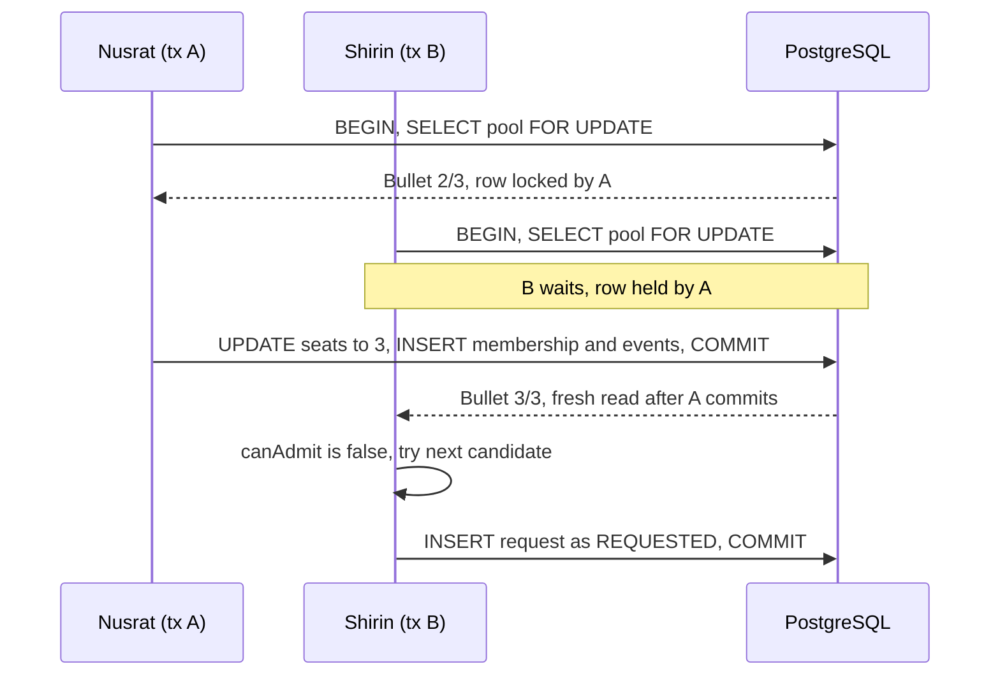

# Concurrency and data consistency

**The scenario:** Bullet has one seat left. Nusrat and Shirin both try to claim it at nearly the same
instant, and both initially observe one free seat. Exactly one may get it, and `seats_occupied` must never
exceed the capacity.

## Three layers, in order of authority

1. **Row lock.** Every use case that changes pool membership opens a transaction and loads the pool with
   `SELECT ... FOR UPDATE` (`LockMode.PESSIMISTIC_WRITE`) _before_ reading its seat count. The second
   transaction blocks until the first commits, then reads the updated count.
2. **Domain check.** `Pool.admit()` re-validates against the freshly locked data, never against data read
   before the lock. The compatibility policy is _passed into_ `admit()`, so the passenger auto-join and the
   driver accept paths cannot diverge.
3. **Database backstop.** `CHECK (seats_occupied BETWEEN 0 AND seat_capacity)` on `pools` makes
   overbooking structurally impossible even if application code has a bug or someone runs raw SQL. A
   violation is SQLSTATE `23514`, mapped to `409 POOL_FULL`.

Partial unique indexes catch the other races: one active request per passenger
(`uq_active_request_per_passenger`), one active pool per vehicle (`uq_active_pool_per_vehicle`), one active
membership per request (`uq_active_membership_per_request`).



## Lock order (this prevents deadlocks)

Always take locks in this order, and never in reverse:

```
vehicle  ->  pool  ->  request
```

| Use case                                                      | Locks taken                                                                                                 |
| ------------------------------------------------------------- | ----------------------------------------------------------------------------------------------------------- |
| Driver: availability, accept, arrive, start, drop-off, cancel | vehicle, then pool, then (accept only) request                                                              |
| Passenger auto-join (`PoolMatcher`)                           | candidate pools in `(created_at, id)` order; the new request row is not visible to anyone else until commit |
| Passenger cancel of a `MATCHED` ride                          | pool, then request (after a first _peek_ to find the pool)                                                  |
| Passenger cancel of a `REQUESTED` ride                        | request only                                                                                                |

The `vehicle` lock serialises one driver's own actions: a double-clicked _accept_ cannot create two pools,
and the unique index is the backstop if it ever did.

Because the passenger cancel path must lock the pool before its own row, it first _peeks_ at the ride
without a lock, locks the pool, then **re-checks** the ride. If something moved in between (the ride was
admitted, or the driver cancelled the pool), the whole use case is retried in a new transaction, up to three
times.

## Isolation level

PostgreSQL default `READ COMMITTED` plus explicit row locks, not `SERIALIZABLE`. Locks make contention
visible and simple to reason about; `SERIALIZABLE` would need serialization-failure retries for no added
correctness here, since pools hold at most a handful of passengers.

## MikroORM pitfalls handled

- Lock the `Pool` row **alone** first and load `memberships` in a **second** query. PostgreSQL rejects
  `FOR UPDATE` across an outer join, which a joined `populate()` would produce.
- Never reuse a `Pool` loaded before the lock: the identity map would hand back stale data. Every use case
  runs on a fresh `EntityManager` fork, and locked reads pass `refresh: true`.

## How the tests prove it

Run with `npm run test:integration` (real Postgres, no fakes):

| Test                                                             | What it shows                                                                                                                                 |
| ---------------------------------------------------------------- | --------------------------------------------------------------------------------------------------------------------------------------------- |
| Nusrat vs Shirin on the last seat, 50 times (`CONCURRENCY_RUNS`) | exactly one `MATCHED`, one `REQUESTED`, `seats_occupied = 3` and the memberships add up to 3 seats                                            |
| Driver accept vs passenger auto-join, 20 times                   | exactly one path gets the last seat; the loser gets `POOL_FULL`                                                                               |
| Eight new passengers for two free seats                          | exactly two matched, Bullet exactly 3/3                                                                                                       |
| **Forced interleaving**                                          | both transactions are held right after they read the pool. With the lock the outcome is unchanged; without it both would see 2/3 and overbook |
| Raw SQL `UPDATE pools SET seats_occupied = 4`                    | refused by the `CHECK`                                                                                                                        |
| Double submit by one passenger                                   | one `201`, one `409 ACTIVE_RIDE_EXISTS`                                                                                                       |
| Passenger cancel racing driver start / driver cancel             | either order leaves a consistent state                                                                                                        |

The suite was validated by mutation: removing `lockMode: PESSIMISTIC_WRITE` from
`PoolRepository.findByIdForUpdate` makes it fail.

## Scaling beyond one Postgres

Each pool row is its own lock, which is fine for an MVP. At city scale hot cells become hot rows; the plan
(`FOR UPDATE SKIP LOCKED` as a bridge, then one matching worker per H3 cell partition, with the `CHECK`
constraint kept as the backstop) is written up in `DESIGN.md` section 16 and deliberately not implemented.
