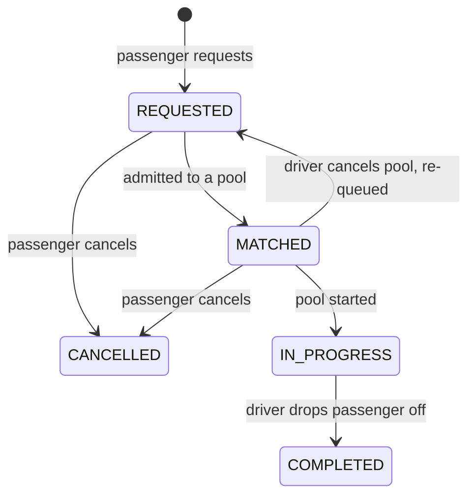
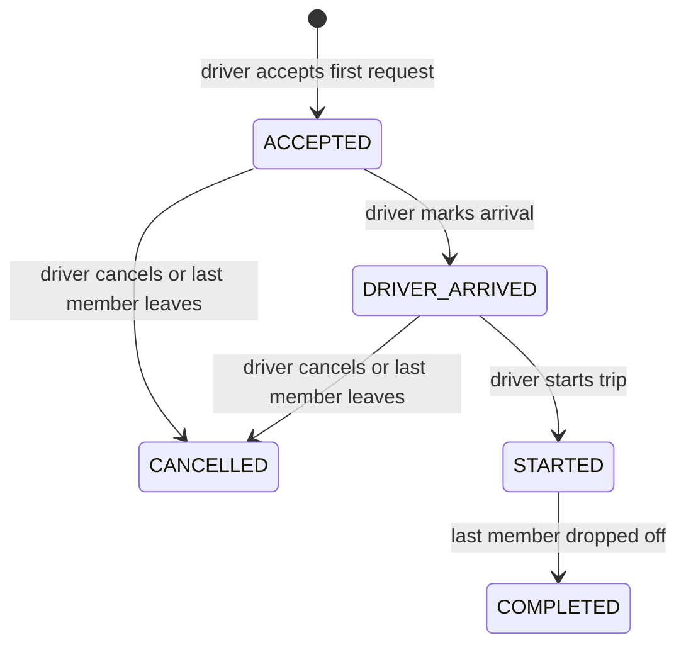

# Domain model

## Two lifecycles

A passenger's journey (`RideRequest`) and one Tesla's trip (`Pool`) are separate state machines,
because passengers join and leave a pool at different times. Each is a single transition table
(`ride-request.lifecycle.ts`, `pool.lifecycle.ts`); anything not in the table raises
`409 INVALID_TRANSITION`. `lifecycles.test.ts` checks every (from, to) pair against an independent
copy of the tables.

## Who owns what

| Class                   | Owns                                                    | Notes                                    |
| ----------------------- | ------------------------------------------------------- | ---------------------------------------- |
| `RideRequest`           | seats, route distance, fare quotes, its own transitions | never touches the `EntityManager`        |
| `Pool` (aggregate root) | `seatsOccupied`, admission, member changes              | `Pool.admit` is the only way in          |
| `PoolMembership`        | who was in which pool, when, and why they left          | a request can pass through several pools |
| `Vehicle`               | capacity, online state and zone                         |                                          |
| `Money`                 | integer paisa arithmetic                                | immutable value object                   |

Domain code throws subclasses of `DomainError` with a stable `code`; a single middleware maps codes to
HTTP statuses. The domain knows nothing about HTTP.

## Audit trail

Aggregates _record_ events while they change (`AggregateRoot.record`). The service hands the
aggregates to `AuditTrail.persist`, which writes them as `ride_events` rows in the **same
transaction**, ordered by a process-wide sequence number so rows follow the order things happened.
The history is therefore produced by the same code that makes the change, and cannot disagree with it.

| Event type                                                           | Recorded by                        | Row has                                                  |
| -------------------------------------------------------------------- | ---------------------------------- | -------------------------------------------------------- |
| `RIDE_REQUESTED`                                                     | `RideRequest.create`               | request id                                               |
| `REQUEST_MATCHED`                                                    | `RideRequest.markMatched`          | request id, pool id                                      |
| `REQUEST_STARTED`                                                    | `RideRequest.start`                | request id, pool id, the locked fare breakdown in `data` |
| `REQUEST_COMPLETED`                                                  | `RideRequest.complete`             | request id, pool id                                      |
| `REQUEST_CANCELLED`                                                  | `RideRequest.cancel`               | request id, pool id (if it was in one)                   |
| `REQUEST_REQUEUED`                                                   | `RideRequest.requeue`              | request id, pool id, `reason: DRIVER_CANCELLED`          |
| `POOL_CREATED`                                                       | `Pool.open`                        | pool id                                                  |
| `PASSENGER_JOINED` / `PASSENGER_LEFT`                                | `Pool.admit` / `Pool.removeMember` | pool id, request id, `seatsOccupied` after               |
| `DRIVER_ARRIVED`, `POOL_STARTED`, `POOL_COMPLETED`, `POOL_CANCELLED` | `Pool`                             | pool id                                                  |

`actor_user_id` is the person who acted; `NULL` means the system (for example an auto-join).

## What a passenger may see

The passenger timeline is built from **their own** request events (`RIDE_REQUESTED`,
`REQUEST_MATCHED`, `REQUEST_STARTED`, `REQUEST_COMPLETED`, `REQUEST_CANCELLED`, `REQUEST_REQUEUED`) plus
`DRIVER_ARRIVED` for the pool they are in. `PASSENGER_JOINED` / `PASSENGER_LEFT` rows carry another
rider's request id, so they are never selected for anyone else. The whitelist lives in
`PASSENGER_TIMELINE_TYPES`; a new event type is invisible to passengers until it is added there.
